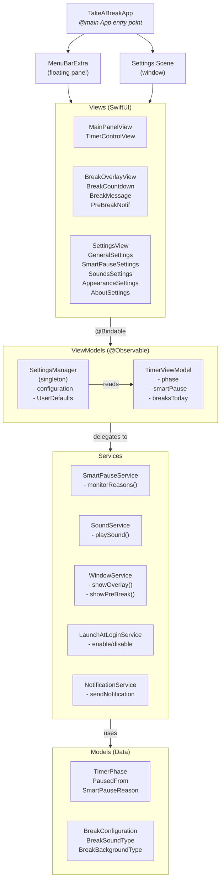
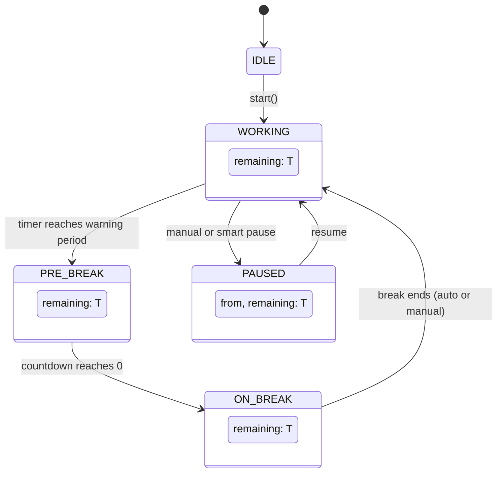
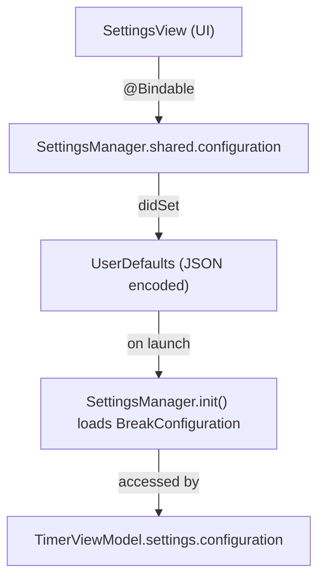
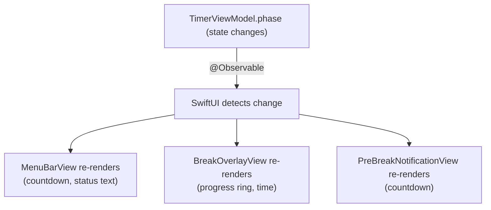
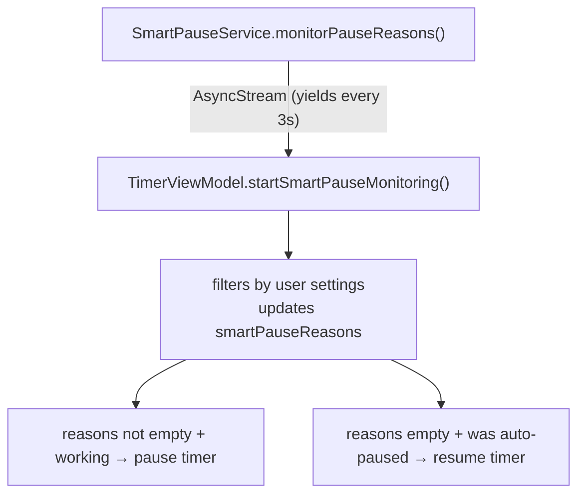
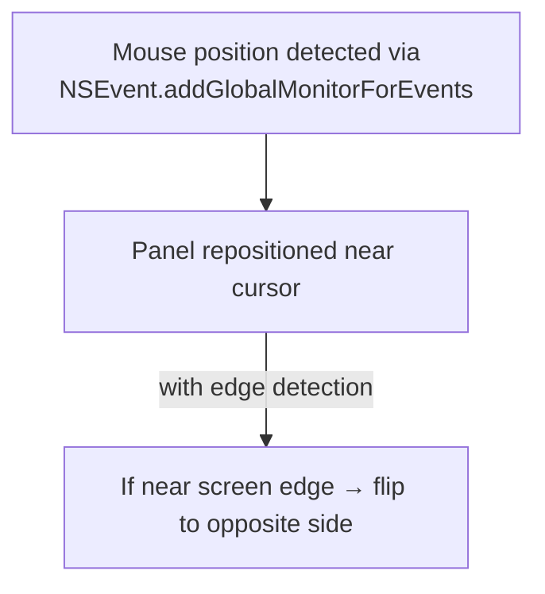

# Architecture — Take a Break

## 1. High-Level Architecture



## 2. Design Patterns

### 2.1 MVVM (Model-View-ViewModel)

The app follows strict MVVM separation:

- **Models** (`Models/`) — Pure data types with no business logic. Enums and structs that define the shape of data.
- **ViewModels** (`ViewModels/`) — State containers using `@Observable`. Own business logic and coordinate services.
- **Views** (`Views/`) — SwiftUI views that bind to ViewModels via `@Bindable`. No direct service access.

### 2.2 Service Layer

Services encapsulate all system-level interactions, keeping ViewModels testable and focused on state:

| Service | Responsibility | System APIs Used |
|---------|---------------|------------------|
| `SmartPauseService` | Monitor recording, camera, fullscreen | `NSWorkspace`, `AVCaptureDevice`, `CGWindowListCopyWindowInfo` |
| `SoundService` | Play system sounds | `NSSound` |
| `WindowService` | Create/manage overlay panels | `NSPanel`, `NSScreen`, `NSEvent` |
| `LaunchAtLoginService` | Register for login launch | `SMAppService` |
| `NotificationService` | System notifications | `UNUserNotificationCenter` |

### 2.3 State Machine

The timer is modeled as a finite state machine via the `TimerPhase` enum:



**Phase transitions:**
- `idle → working` — User clicks Start
- `working → preBreak` — Remaining time reaches warning threshold
- `preBreak → onBreak` — Warning countdown reaches 0
- `onBreak → working` — Break completes (auto) or user ends early
- `working ↔ paused` — Manual pause or smart pause trigger/release

### 2.4 Async Task-Based Timing

Instead of `Timer.scheduledTimer`, the app uses Swift Concurrency:

```swift
timerTask = Task {
    while !Task.isCancelled {
        try? await Task.sleep(for: .seconds(0.5))  // 2 ticks/second
        let remaining = target.timeIntervalSince(Date.now)
        // Update phase...
    }
}
```

Benefits:
- Clean cancellation via `Task.cancel()`
- No retain cycle concerns (uses `[weak self]`)
- Date-based accuracy (not accumulated intervals)
- Runs on `@MainActor` for thread safety

## 3. Data Flow

### 3.1 Settings Flow



`SettingsManager` is a singleton using `@Observable`. When any property of `BreakConfiguration` changes, it is automatically JSON-encoded and written to `UserDefaults`. On launch, it decodes the stored JSON or falls back to defaults.

### 3.2 Timer → UI Flow



### 3.3 Smart Pause Flow



## 4. Window Management

### 4.1 Break Overlay (Multi-Screen)

`WindowService` creates one `NSPanel` per connected `NSScreen`:

```swift
for screen in NSScreen.screens {
    let panel = NSPanel(...)
    panel.setFrame(screen.frame, display: true)
    panel.level = .screenSaver  // Above most windows
    panel.styleMask = [.borderless, .nonactivatingPanel]
    // Host SwiftUI BreakOverlayView
}
```

Properties:
- `level: .screenSaver` — Displays above normal windows
- `styleMask: .nonactivatingPanel` — Doesn't steal focus
- `collectionBehavior: .canJoinAllSpaces` — Visible on all Spaces
- `NSVisualEffectView.material` — Dynamic based on user's blur radius setting (`.sheet` for 0–5, `.hudWindow` for 5–15, `.fullScreenUI` for 15+)
- Overlay opacity driven by `overlayOpacity` config value

### 4.2 Pre-Break Notification

A floating `NSPanel` that tracks the mouse cursor:



Properties:
- `ignoresMouseEvents: true` — Click-through
- `level: .floating` — Above normal windows but below overlay
- Positioned with offset from cursor, respecting screen bounds

## 5. File Dependency Graph

```
TakeABreakApp.swift
├── TimerViewModel
│   ├── SettingsManager → BreakConfiguration
│   │                     ├── BreakSoundType
│   │                     └── BreakBackgroundType
│   ├── SmartPauseService → SmartPauseReason
│   ├── SoundService → BreakSoundType
│   ├── WindowService
│   │   ├── BreakOverlayView
│   │   │   ├── BreakCountdownView
│   │   │   └── BreakMessageView
│   │   └── PreBreakNotificationView
│   └── AppState (TimerPhase, PausedFrom)
│
├── MainPanelView
│   └── TimerControlView
│
└── SettingsView
    ├── GeneralSettingsView
    ├── SmartPauseSettingsView
    ├── SoundsSettingsView
    ├── AppearanceSettingsView
    └── AboutSettingsView
```

## 6. Key Technical Decisions

| Decision | Choice | Rationale |
|----------|--------|-----------|
| State management | `@Observable` (Swift 5.9) | Modern, less boilerplate than `ObservableObject` |
| Timer implementation | `Task.sleep` with `Date` targets | More accurate than accumulated intervals; clean cancellation |
| Overlay windows | `NSPanel` (not SwiftUI Window) | Full control over window level, activation behavior, and multi-screen |
| Smart pause polling | `AsyncStream` with 3s interval | Lightweight; avoids notification-based complexity |
| Settings persistence | `UserDefaults` + `Codable` JSON | Simple, reliable; no need for Core Data or files |
| Sound playback | `NSSound` (system sounds) | Zero-dependency; instant playback; no bundled audio files |
| Menu bar | `MenuBarExtra` with `.window` style | Native SwiftUI API; proper popover behavior |
| Project generation | XcodeGen (`project.yml`) | Avoids Xcode project merge conflicts; declarative configuration |
| Dependencies | None | Reduces maintenance burden; all requirements met by platform APIs |

## 7. Threading Model

```
@MainActor
├── TimerViewModel (all state mutations)
├── WindowService (NSPanel operations)
├── All SwiftUI Views
│
Background (via Task)
├── Timer tick loops (sleep + main actor callback)
├── SmartPauseService.monitorPauseReasons()
│   └── Yields to MainActor via AsyncStream consumption
```

All state is confined to `@MainActor`. Background work is limited to:
- `Task.sleep` intervals in timer loops
- System API calls in `SmartPauseService` (polling)

Both feed results back to the main actor through Swift Concurrency's actor isolation.
